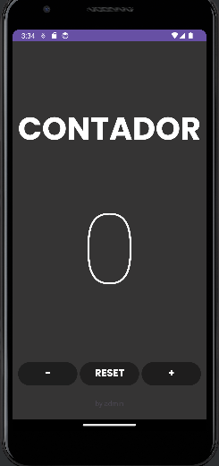

# Ejercicio 02

Crea la segunda pantalla en el mismo proyecto(investiga como). Deberás realizar un lógin tal y como
se muestra en el figma, en el caso de que el usuario y contraseña sean admin en el TextView de abajo
saldrá “Usuario y contraseña correcta” en caso contrario “Usuario o contraseña incorrecta”.
Investigar por vuestra cuenta como iniciar la aplicación en la Activity login. Pista → se configura
en el AndroidManifest.xml. Una vez que iniciemos el login deberá pasar a la pantalla del contador
pasando el dato del nombre del usuario (aparecerá en la parte baja de la pantalla de contador donde
ponía “by nombre_alumno”).(ACTUALIZADO)

## Pantalla Login

La pantalla principal nos encontramos el Login en el cual hay dos campos para insertar el usuario y
la contraseña. Si el usuario o la contraseña es incorrecta saltará un mensaje de error como podemos
observar en la siguiente imagen

Si el usuario y contraseña son correctos accederemos a la siguiente pantalla al hacer click al boton
de Login la cual es la pantalla del contador.

### Componentes Utilizados:
- **TextInputEditText** para el nombre de usuario
  **TextInputEditText** para la contraseña 
- **Botón para darle click e iniciar sesión**
- **TextView** para mostrar si el usuario y la contraseña introducidos han sido correctos

## Pantalla Contador

Realizamos una pantalla de contador con un 0 inicial en el medio, los botones para sumar, restar
y resetear el contador.

Los botones del contador estan metidos en un **linearLayout** en el cual esta puesto para que los
botones esten en el centro y los propios botones con un margin para que haya ese hueco de separación.
La aplicación presenta un **ConstraintLayout** para organizar los elementos que se encuentran en
ella.

### Componentes Utilizados:
- **TextView** para mostrar la palabra **CONTADOR** y el número 0 que puede ser incrementado, 
    reseteado y decrementado.
- **Botones para realizar las operaciones mencionadas anteriormente**
- **TextView** para mostrar el nombre de usuario en la parte inferior de la aplicación

## Versión de Android
**La version del android es la 21 que tenia un porcentaje del 99,6%**

## Programa utilizado
**Android Studio**