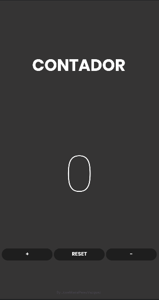

Deberás recrear en android la aplicación del contador que se os proporciona. El diseño se os pasará
por figma (abajo teneis el enlace). En este primer ejercicio solo debes hacer la parte visual, nada
de lógica. Asegurate de que el resultado final sea identico al proporcionado, en tu criterio queda
elegir el o los tipos de layouts que utilizarás. Mediante figma obtén el tipo de fuente, colores etc
que debes utilizar en tu aplicación.

Realizamos una pantalla de contador con un 0 inicial en el medio, los botones para sumar, restar y
resetear el contador.

Los botones del contador estan metidos en un linearLayout en el cual esta puesto para que los
botones esten en el centro y los propios botones con un margin para que haya ese hueco de separacion

La version del android es la 21 que tenia un porcentaje del 99,6%

