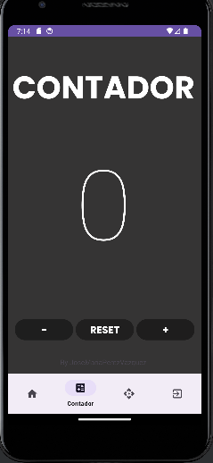
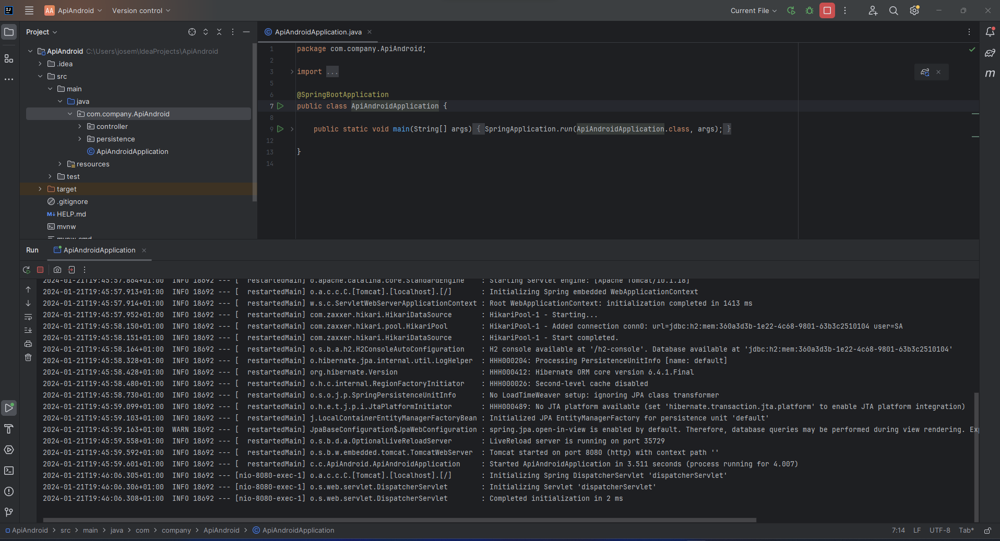
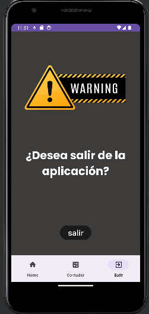
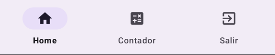

# Proyecto Final Multimedia 

Aplicación de Android Studio consumiento una API con un sistema de logueo a través de Google,
con un Home donde aparece una lista con los elementos de la API, CRUD y una ventana para volver
a la pantalla de logueo

## Pantalla Login

La pantalla principal nos encontramos el Login en el cual hay dos campos para insertar el usuario y
la contraseña. Nosotros utilizaremos el login de Google que hemos implementado y verificamos que el
login de Google ha sido correcto a través de un Toast

La clase activity_login es una implementación en Android que maneja el proceso de inicio de sesión
en una aplicación. La aplicación permite a los usuarios iniciar sesión de dos maneras: a través de
credenciales de usuario (nombre de usuario y contraseña) o mediante el inicio de sesión de Google.
Nosotros usamos el de Google como hemos mencionado anteriormente.

## Estructura general de la clase

### Atributos y Variables de Instancia:
- `usuario`: Campo de texto para el nombre de usuario.
- `contraseña`: Campo de texto para la contraseña.
- `RC_SIGN_IN`: Código de solicitud para el inicio de sesión con Google.
- `mGoogleSignInClient`: Cliente para el inicio de sesión con Google.
- `mAuth`: Objeto de Firebase Authentication.
- `TAG`: Etiqueta para mensajes de registro (log).
- `signInButton`: Botón de inicio de sesión con Google.

### Métodos:

#### `onCreate`
- Inicializa los componentes de la interfaz de usuario.
- Configura el botón de inicio de sesión con Google.
- Configura Firebase Authentication y el cliente de inicio de sesión con Google.

#### `onStart`
- Verifica si el usuario ya ha iniciado sesión y actualiza la interfaz de usuario en consecuencia.

#### `signIn`
- Inicia el proceso de inicio de sesión con Google.

#### `onActivityResult`
- Verifica el resultado de la operación de inicio de sesión con Google y realiza la autenticación en Firebase si la operación fue exitosa.

#### `firebaseAuthWithGoogle`
- Autentica al usuario en Firebase utilizando la credencial de Google.

#### `updateUI`
- Actualiza la interfaz de usuario después de un inicio de sesión (o fallo) exitoso.
- Muestra un Toast de "Inicio de sesión exitoso" en caso de éxito.
- Verifica si el cierre de sesión fue la causa para evitar mostrar el Toast en ese caso.
- Muestra un Toast de "Inicio de sesión fallido" en caso de fallo.

#### `goHome`
- Redirige a la pantalla principal (MainActivity) después de un inicio de sesión exitoso.

#### `login`
- Invocado al hacer clic en el botón de inicio de sesión con credenciales de usuario.
- Verifica las credenciales ("admin/admin") y redirige al usuario a la pantalla principal si son correctas.

## Uso de Firebase Authentication y Google SignIn
- Utiliza Firebase Authentication para manejar la autenticación de usuarios.
- Utiliza la API de Google SignIn para permitir que los usuarios inicien sesión con sus cuentas de Google.

## Flujo Típico de la Aplicación

### Inicio de Sesión con Google:
1. El usuario hace clic en el botón de inicio de sesión con Google.
2. Se inicia la actividad de inicio de sesión con Google.
3. El resultado de la operación se maneja en `onActivityResult`.
4. Si es exitoso, se autentica al usuario en Firebase.

### Inicio de Sesión con Credenciales de Usuario:
1. El usuario ingresa las credenciales (nombre de usuario y contraseña).
2. Se verifica si las credenciales son correctas.
3. Si son correctas, se redirige al usuario a la pantalla principal.

### Manejo de Sesión:
- `onStart` verifica si el usuario ya ha iniciado sesión y actualiza la interfaz de usuario en consecuencia.
- `updateUI` maneja la actualización de la interfaz después del inicio de sesión o cierre de sesión.

## Consideraciones
- Se muestra un Toast para informar al usuario sobre el estado del inicio de sesión.

## Pantalla Home (Fragment)

Este fragmento de la pantalla de inicio muestra en primer lugar un mensaje de bienvenida para el 
usuario junto a una foto para el aspecto visual

### Componentes Utilizados:
- **TextView** para mostrar el mensaje de bienvenida
- **ImageView** para poder poner una foto en la pantalla de inicio

## Pantalla Contador

Realizamos una pantalla de contador con un 0 inicial en el medio, los botones para sumar, restar
y resetear el contador.

Los botones del contador estan metidos en un **linearLayout** en el cual esta puesto para que los
botones esten en el centro y los propios botones con un margin para que haya ese hueco de separación.
La aplicación presenta un **ConstraintLayout** para organizar los elementos que se encuentran en
ella.

### Componentes Utilizados:
- **TextView** para mostrar la palabra **CONTADOR** y el número 0 que puede ser incrementado, 
    reseteado y decrementado.
- **Botones para realizar las operaciones mencionadas anteriormente**
- **TextView** para mostrar el nombre de usuario en la parte inferior de la aplicación

## Pantalla API (Fragment)

En la pantalla no se muestra nada en primer lugar solo consume una API creada en SpringBoot que 
hemos inicializado anteriormente.

### Comprobación de que funciona la API

### API funcionado en Android

### Funcionamiento de las clases
**Interfaz CRUDInterface**: Establece las operaciones CRUD para interactuar con la API. En este 
proyecto usamos un **getAll** para que nos de todos los productos.

**Clase Product**:  Representa la clase de los **Productos** con su **ID, nombre y precio** junto al 
método **toString** para el tema visual.

**Clase Constants**: Una clase con constantes donde se encuentra la **URL** de la API. En primer
lugar tiene la local de mi dispositivo y en segundo lugar la de mi centro educativo en casa de que 
fuera necesario.

**Fragment**: Creación de un fragment que se añade a la **barra de navegación** donde da lugar a la
pestaña donde se consume la API aunque actualmente no tiene ningún funcionamiento más ni ninguna
imagen de visualización.

## Pantalla Exit (Fragment)

Este fragmento de la pantalla de salida muestra en primer lugar una imagen de warning para avisar
al usuario de forma visual como que va a salir de la aplición, a continuación, mostramos el mensaje
para verificar que el usuario desea salir de la aplicación y acto seguido se encuentra el boton
que al darle click sale de la aplicación

### Componentes Utilizados:
- **TextView** para mostrar el mensaje de si desea salir de la aplicación
- **ImageView** para la foto de warning en la pantalla de salida
- **Button** para el boton el cual nos da posibilidad de salir de la aplicación

## Menú de Navegación

El menú de navigación de la parte inferior permite al usuario poder navegar entre las diferentes
pantallas de la aplicación

### Componentes Utilizados:
- **bottom_navigation_menu** en el cual se encuentra los tres diferentes items: **Home** para la
    pantalla de inicio, **Contador** para la pantalla de contador y **Salir** para la pantalla de 
    salir.
    En él te da la opción para elegir diferentes imagenes/logos para poner en tu menú.

## Versión de Android
**La version del android es la 21 que tiene un porcentaje del 99,6%**

## Programa utilizado
**Android Studio**

## Autor
**José María Pérez Vázquez**
