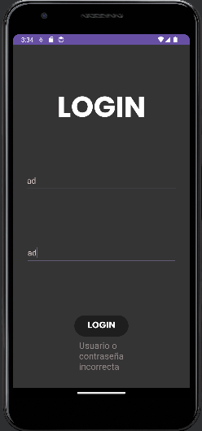

# Ejercicio 03 

Cambia el proyecto para que el segundo activity en vez de ser el contador sea un activity con un
FrameLayout en el que se verán los diferentes fragments (mínimo home, contador, salir) y por
otra parte una barra de navegación con la que podamos viajar entre los diferentes fragments.

## Pantalla Login

La pantalla principal nos encontramos el Login en el cual hay dos campos para insertar el usuario y
la contraseña. Si el usuario o la contraseña es incorrecta saltará un mensaje de error como podemos
observar en la siguiente imagen

Si el usuario y contraseña son correctos accederemos a la siguiente pantalla al hacer click al boton
de Login la cual es la pantalla del contador.

### Componentes Utilizados:
- **TextInputEditText** para el nombre de usuario
  **TextInputEditText** para la contraseña 
- **Botón para darle click e iniciar sesión**
- **TextView** para mostrar si el usuario y la contraseña introducidos han sido correctos

## Pantalla Home (Fragment)

Este fragmento de la pantalla de inicio muestra en primer lugar un mensaje de bienvenida para el 
usuario junto a una foto para el aspecto visual

### Componentes Utilizados:
- **TextView** para mostrar el mensaje de bienvenida
- **ImageView** para poder poner una foto en la pantalla de inicio

## Pantalla Contador

Realizamos una pantalla de contador con un 0 inicial en el medio, los botones para sumar, restar
y resetear el contador.

Los botones del contador estan metidos en un **linearLayout** en el cual esta puesto para que los
botones esten en el centro y los propios botones con un margin para que haya ese hueco de separación.
La aplicación presenta un **ConstraintLayout** para organizar los elementos que se encuentran en
ella.

### Componentes Utilizados:
- **TextView** para mostrar la palabra **CONTADOR** y el número 0 que puede ser incrementado, 
    reseteado y decrementado.
- **Botones para realizar las operaciones mencionadas anteriormente**
- **TextView** para mostrar el nombre de usuario en la parte inferior de la aplicación

## Pantalla Exit (Fragment)

Este fragmento de la pantalla de salida muestra en primer lugar una imagen de warning para avisar
al usuario de forma visual como que va a salir de la aplición, a continuación, mostramos el mensaje
para verificar que el usuario desea salir de la aplicación y acto seguido se encuentra el boton
que al darle click sale de la aplicación

### Componentes Utilizados:
- **TextView** para mostrar el mensaje de si desea salir de la aplicación
- **ImageView** para la foto de warning en la pantalla de salida
- **Button** para el boton el cual nos da posibilidad de salir de la aplicación

## Menú de Navegación

El menú de navigación de la parte inferior permite al usuario poder navegar entre las diferentes
pantallas de la aplicación

### Componentes Utilizados:
- **bottom_navigation_menu** en el cual se encuentra los tres diferentes items: **Home** para la
    pantalla de inicio, **Contador** para la pantalla de contador y **Salir** para la pantalla de 
    salir.
    En él te da la opción para elegir diferentes imagenes/logos para poner en tu menú.

## Versión de Android
**La version del android es la 21 que tiene un porcentaje del 99,6%**

## Programa utilizado
**Android Studio**