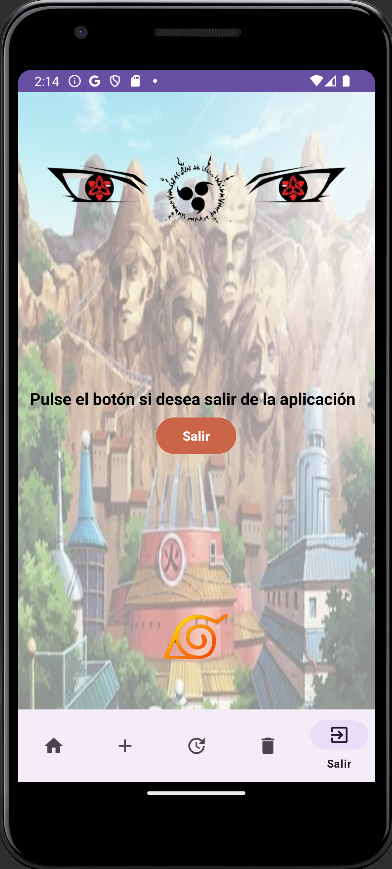

# Proyecto Final Multimedia 

Aplicación de Android Studio consumiento una API con un sistema de logueo a través de Google,
con un Home donde aparece una lista con los elementos de la API, CRUD y una ventana para volver
a la pantalla de logueo

## Pantalla Login

La pantalla principal nos encontramos el Login en el cual hay dos campos para insertar el usuario y
la contraseña. Nosotros utilizaremos el login de Google que hemos implementado y verificamos que el
login de Google ha sido correcto a través de un Toast

La clase activity_login es una implementación en Android que maneja el proceso de inicio de sesión
en una aplicación. La aplicación permite a los usuarios iniciar sesión de dos maneras: a través de
credenciales de usuario (nombre de usuario y contraseña) o mediante el inicio de sesión de Google.
Nosotros usamos el de Google como hemos mencionado anteriormente.

## Estructura general de la clase

### Atributos y Variables de Instancia:
- `usuario`: Campo de texto para el nombre de usuario.
- `contraseña`: Campo de texto para la contraseña.
- `RC_SIGN_IN`: Código de solicitud para el inicio de sesión con Google.
- `mGoogleSignInClient`: Cliente para el inicio de sesión con Google.
- `mAuth`: Objeto de Firebase Authentication.
- `TAG`: Etiqueta para mensajes de registro (log).
- `signInButton`: Botón de inicio de sesión con Google.

### Métodos:

#### `onCreate`
- Inicializa los componentes de la interfaz de usuario.
- Configura el botón de inicio de sesión con Google.
- Configura Firebase Authentication y el cliente de inicio de sesión con Google.

#### `onStart`
- Verifica si el usuario ya ha iniciado sesión y actualiza la interfaz de usuario en consecuencia.

#### `signIn`
- Inicia el proceso de inicio de sesión con Google.

#### `onActivityResult`
- Verifica el resultado de la operación de inicio de sesión con Google y realiza la autenticación en Firebase si la operación fue exitosa.

#### `firebaseAuthWithGoogle`
- Autentica al usuario en Firebase utilizando la credencial de Google.

#### `updateUI`
- Actualiza la interfaz de usuario después de un inicio de sesión (o fallo) exitoso.
- Muestra un Toast de "Inicio de sesión exitoso" en caso de éxito.
- Verifica si el cierre de sesión fue la causa para evitar mostrar el Toast en ese caso.
- Muestra un Toast de "Inicio de sesión fallido" en caso de fallo.

#### `goHome`
- Redirige a la pantalla principal (MainActivity) después de un inicio de sesión exitoso.

#### `login`
- Invocado al hacer clic en el botón de inicio de sesión con credenciales de usuario.
- Verifica las credenciales ("admin/admin") y redirige al usuario a la pantalla principal si son correctas.

## Uso de Firebase Authentication y Google SignIn
- Utiliza Firebase Authentication para manejar la autenticación de usuarios.
- Utiliza la API de Google SignIn para permitir que los usuarios inicien sesión con sus cuentas de Google.

## Flujo Típico de la Aplicación

### Inicio de Sesión con Google:
1. El usuario hace clic en el botón de inicio de sesión con Google.
2. Se inicia la actividad de inicio de sesión con Google.
3. El resultado de la operación se maneja en `onActivityResult`.
4. Si es exitoso, se autentica al usuario en Firebase.

### Inicio de Sesión con Credenciales de Usuario:
1. El usuario ingresa las credenciales (nombre de usuario y contraseña).
2. Se verifica si las credenciales son correctas.
3. Si son correctas, se redirige al usuario a la pantalla principal.

### Manejo de Sesión:
- `onStart` verifica si el usuario ya ha iniciado sesión y actualiza la interfaz de usuario en consecuencia.
- `updateUI` maneja la actualización de la interfaz después del inicio de sesión o cierre de sesión.

## Consideraciones
- Se muestra un Toast para informar al usuario sobre el estado del inicio de sesión.

## Pantalla Home (Fragment)

En este fragmento mostramos una lista de los elementos de nuestra API en el cual se puede hacer scroll.

## Estructura General de la Clase HomeFragment

### Atributos y Variables de Instancia:

- **`personajeList`:** Lista que contiene objetos de la clase Personaje.
- **`crudInterface`:** Instancia de la interfaz `CRUDInterface` para realizar operaciones CRUD (Create, Read, Update, Delete) en el servidor.
- **`listView`:** Vista de lista utilizada para mostrar la lista de personajes.

### Métodos:

#### `onCreate`

- Constructor vacío requerido por la arquitectura de fragmentos de Android.

#### `getAll`

- Método para obtener la lista de personajes del servidor mediante Retrofit y actualizar la interfaz de usuario.

#### `onCreateView`

- Método llamado para crear y devolver la vista del fragmento.
- Infla el diseño del fragmento y configura los elementos de la interfaz de usuario.

## Uso de Retrofit y Actualización de la Interfaz

El método `getAll` utiliza Retrofit para realizar una llamada asíncrona al servidor y obtener la lista de personajes. La respuesta se maneja de manera asincrónica, actualizando la interfaz con la información obtenida.

## Clase Adapter que usa la clase anterior HomeFragment

La clase `PersonajeAdapter` es un adaptador personalizado utilizado para poblar un `ListView` o `GridView` con objetos `Personaje`. Extiende `BaseAdapter` y proporciona métodos para manejar la vinculación de datos entre el conjunto de datos y los componentes de la interfaz de usuario.

El adaptador utiliza el patrón ViewHolder para el reciclaje eficiente de vistas y la optimización del rendimiento.

## Estructura General de la Clase

### Atributos y Variables de Instancia:

- **`personajes`:** La lista de objetos `Personaje` que se mostrarán en el adaptador.
- **`context`:** El contexto en el que se utiliza el adaptador.

### Métodos:

#### `PersonajeAdapter(Context context, List<Personaje> personajes)`

- Construye un nuevo `PersonajeAdapter` con el contexto y la lista de personajes especificados.

#### `getCount()`

- Devuelve el número total de elementos en el conjunto de datos.

#### `getItem(int position)`

- Devuelve el elemento en la posición especificada.

#### `getItemId(int position)`

- Devuelve el identificador único para el elemento en la posición especificada.

#### `getView(int position, View convertView, ViewGroup parent)`

- Devuelve una vista que muestra la información en la posición especificada en el conjunto de datos.

## Uso del Patrón ViewHolder

La clase `ViewHolder` actúa como un contenedor para las vistas de cada elemento en la interfaz de usuario. Esto mejora el rendimiento al reciclar vistas y evitar inflados innecesarios.

### Atributos de `ViewHolder`:

- **`nameText`:** `TextView` para mostrar el nombre del personaje.
- **`descripcionText`:** `TextView` para mostrar la descripción del personaje.
- **`imageView`:** `ImageView` para mostrar la imagen del personaje.

## Pantalla Crear Personaje

## Estructura General de la Clase

### Atributos y Variables de Instancia:

- `nameText`: Campo de texto para el nombre del personaje.
- `descriptionText`: Campo de texto para la descripción del personaje.
- `editTextUrlImagen`: Campo de texto para la URL de la imagen del personaje.
- `button`: Botón para iniciar el proceso de creación del personaje.
- `crudInterface`: Interfaz para realizar operaciones CRUD (Create, Read, Update, Delete) en el servidor.

### Métodos:

#### `onCreate(Bundle savedInstanceState)`

- Método llamado al crear el fragmento.

#### `onCreateView(LayoutInflater inflater, ViewGroup container, Bundle savedInstanceState)`

- Método llamado para crear y devolver la vista del fragmento.
- Infla el diseño del fragmento y configura los elementos de la interfaz de usuario.

#### `create(PersonajeDTO personajeDTO)`

- Método que realiza la creación de un nuevo personaje en el servidor mediante Retrofit.
- Inicializa la interfaz `CRUDInterface`.
- Realiza la llamada al servidor para crear el personaje.
- Muestra un mensaje de éxito en caso de una respuesta exitosa.

 

#### `mostrarToast(String mensaje)`

- Método para mostrar un mensaje Toast en la interfaz de usuario.

## Uso del Fragmento

1. **Inflar el diseño del fragmento:**
   - Se utiliza el método `onCreateView` para inflar el diseño del fragmento.

2. **Inicializar elementos de la interfaz de usuario:**
   - Los campos de texto (`nameText`, `descriptionText`, `editTextUrlImagen`) y el botón (`button`) se inicializan en `onCreateView`.

3. **Manejar clics en el botón:**
   - Al hacer clic en el botón, se recopilan los datos ingresados y se valida que todos los campos estén completos.
   - Se crea un objeto `PersonajeDTO` con los datos ingresados.
   - Se llama al método `create` para iniciar el proceso de creación del personaje.

4. **Crear un nuevo personaje:**
   - En el método `create`, se utiliza Retrofit para realizar una llamada al servidor y crear un nuevo personaje.
   - Se muestra un mensaje de éxito en caso de respuesta exitosa.

5. **Mostrar mensajes Toast:**
   - El método `mostrarToast` se utiliza para mostrar mensajes de éxito o error en la interfaz de usuario.
  

## Pantalla Actualizar Personaje

## Estructura General de la Clase

### Atributos y Variables de Instancia:

- `nameText`: Campo de texto para el nombre del personaje.
- `descriptionText`: Campo de texto para la descripción del personaje.
- `editTextUrlImagen`: Campo de texto para la URL de la imagen del personaje.
- `button`: Botón utilizado para iniciar la actualización del personaje.
- `idText`: Campo de texto para ingresar el ID del personaje que se desea actualizar.
- `retrofit`: Instancia de Retrofit utilizada para configurar la conexión a la API.
- `crudInterface`: Interfaz que define métodos para realizar operaciones CRUD (Crear, Leer, Actualizar, Eliminar) en la API.

### Métodos:

#### `onCreateView(LayoutInflater inflater, ViewGroup container, Bundle savedInstanceState)`

- Método llamado para crear y devolver la vista asociada al fragmento.
- Infla el diseño del fragmento y configura los elementos de la interfaz de usuario.
- Inicializa los EditText y Retrofit.
- Agrega un listener al botón para manejar clics y llama al método `actualizar`.

#### `actualizar()`

- Método utilizado para realizar la actualización de un personaje mediante una llamada a la API.
- Obtiene los valores de los campos de entrada, verifica si están vacíos y crea un objeto `PersonajeDTO` con los datos proporcionados.
- Llama al método `CRUDInterface#actualizar` para realizar la actualización.
- Muestra un Toast indicando el resultado de la operación.
  
 

#### `mostrarToast(String mensaje)`

- Método utilizado para mostrar un mensaje Toast en la interfaz de usuario.

## Uso del Fragmento

1. **Inflar el diseño del fragmento:**
   - Se utiliza el método `onCreateView` para inflar el diseño del fragmento y configurar los elementos de la interfaz de usuario.

2. **Inicializar elementos de la interfaz de usuario y Retrofit:**
   - Los campos de texto (`nameText`, `descriptionText`, `editTextUrlImagen`, `idText`) y Retrofit se inicializan en `onCreateView`.

3. **Manejar clics en el botón:**
   - Al hacer clic en el botón, se llama al método `actualizar` para realizar la actualización del personaje.

4. **Actualizar un personaje:**
   - En el método `actualizar`, se obtienen los valores de los campos de entrada, se verifica si están vacíos y se crea un objeto `PersonajeDTO`.
   - Se llama al método `CRUDInterface#actualizar` para realizar la actualización.
   - Se muestra un Toast indicando el resultado de la operación si ha sido exitoso o fallido.

## Pantalla Eliminar Personaje

## Estructura General de la Clase

### Atributos y Variables de Instancia:

- `crudInterface`: Interfaz para realizar operaciones CRUD (Create, Read, Update, Delete) en el servidor.
- `button`: Botón utilizado para iniciar el proceso de eliminación del personaje.
- `idEditText`: Campo de texto para ingresar el ID del personaje que se desea eliminar.

### Métodos:

#### `onCreateView(LayoutInflater inflater, ViewGroup container, Bundle savedInstanceState)`

- Método llamado para crear y devolver la vista asociada al fragmento.
- Infla el diseño del fragmento y configura los elementos de la interfaz de usuario.
- Inicializa el EditText para el ID y configura el botón de borrado.

#### `setupDeleteButton(View view)`

- Configura el botón de borrado para manejar clics del usuario.

#### `delete(int id)`

- Realiza la eliminación de un personaje en el servidor mediante Retrofit.
- Construye la instancia de Retrofit y crea la interfaz CRUDInterface.
- Llama al método de borrado con el ID del personaje.
- Muestra un Toast indicando el resultado de la operación.
  
  

#### `mostrarToast(String mensaje)`

- Método para mostrar un mensaje Toast en la interfaz de usuario.

## Uso del Fragmento

1. **Inflar el diseño del fragmento:**
   - Se utiliza el método `onCreateView` para inflar el diseño del fragmento y configurar los elementos de la interfaz de usuario.

2. **Configurar el botón de borrado:**
   - El botón se configura para manejar clics del usuario y llama al método `delete` para realizar la eliminación del personaje.

3. **Eliminar un personaje:**
   - Al hacer clic en el botón, se obtiene el ID ingresado por el usuario.
   - Se llama al método `delete` con el ID del personaje.
   - Se muestra un Toast indicando el resultado de la operación.

## Pantalla Cerra Sesión

## Estructura General de la Clase

### Atributos y Variables de Instancia:

- `firebaseAuth`: Instancia de FirebaseAuth para gestionar la autenticación del usuario.

### Métodos:

#### `onCreateView(LayoutInflater inflater, ViewGroup container, Bundle savedInstanceState)`

- Método llamado para crear y devolver la vista asociada al fragmento.
- Infla el diseño del fragmento y configura los elementos de la interfaz de usuario.
- Inicializa la instancia de `FirebaseAuth`.
- Configura el listener para el botón de salida.

#### `logOut()`

- Método para cerrar sesión y regresar a la pantalla de inicio de sesión.
- Utiliza Firebase Authentication para cerrar sesión.
- Llama al método `backToLogin` para navegar de vuelta a la pantalla de inicio de sesión.

#### `backToLogin()`

- Método para iniciar una nueva actividad que represente la pantalla de inicio de sesión.

## Barra de Navegación

## Estructura General de la Clase

### Métodos:

#### `onCreate(Bundle savedInstanceState)`

- Método llamado al crear la actividad.
- Configura la interfaz de usuario y la navegación en la actividad principal.
  - Obtiene la referencia al `BottomNavigationView` desde el diseño.
  - Establece el fragmento de inicio como seleccionado.
  - Obtiene el fragmento de navegación anidado.
  - Obtiene el controlador de navegación asociado al fragmento de navegación.
  - Configura el listener para los elementos del `BottomNavigationView`, navegando al fragmento correspondiente según el elemento seleccionado.
 
## Dependencias

- **AndroidX AppCompat**: Biblioteca que brinda compatibilidad con versiones antiguas de Android, permitiendo el uso de las últimas características en dispositivos más antiguos.

- **Material Components for Android**: Biblioteca de diseño de Material que ofrece componentes de interfaz de usuario coherentes y atractivos siguiendo las directrices de diseño de Material.

- **ConstraintLayout**: Diseño de Android que permite crear interfaces de usuario grandes y complejas con una jerarquía de vistas plana.

- **CardView**: Proporciona un contenedor para representar información de manera estructurada en tarjetas con esquinas redondeadas.

- **Picasso**: Biblioteca para cargar y mostrar imágenes de manera eficiente en Android.

- **Navigation Component**: Componente de navegación que simplifica la implementación de la navegación en la aplicación Android.

- **Fragment**: Biblioteca que facilita la creación de interfaces de usuario modulares en Android.

- **JUnit**:  Permite escribir y ejecutar pruebas para verificar el correcto funcionamiento de unidades individuales de código, como métodos o clases
  
- **Firebase Authentication**: Servicio de autenticación proporcionado por Firebase para la gestión de usuarios en la aplicación.

- **Google Play Services Auth**: Librería de servicios de Google Play para la autenticación.

- **Retrofit**: Biblioteca de cliente HTTP para Android y Java que simplifica el consumo de servicios web.

- **Gson Converter for Retrofit**: Convertidor de Gson para Retrofit, que permite la conversión entre objetos JSON y clases Java.

- **JUnit for Android**: Biblioteca de pruebas unitarias para Android.

- **Espresso Core**: Marco de pruebas de interfaz de usuario para realizar pruebas de interfaz de usuario en Android.

## Versión de Android
**La version del android es la 21 que tiene un porcentaje del 99,6%**

## Programa utilizado
**Android Studio**

## Autor
**José María Pérez Vázquez**
